<!-- _paginate: false -->
<!-- _header: '' -->

# Taller: Crea el teu primer videojoc

### Centre de la Imatge i la Tecnologia Multimèdia (CITM·UPC)

Christian Martínez De La Rosa

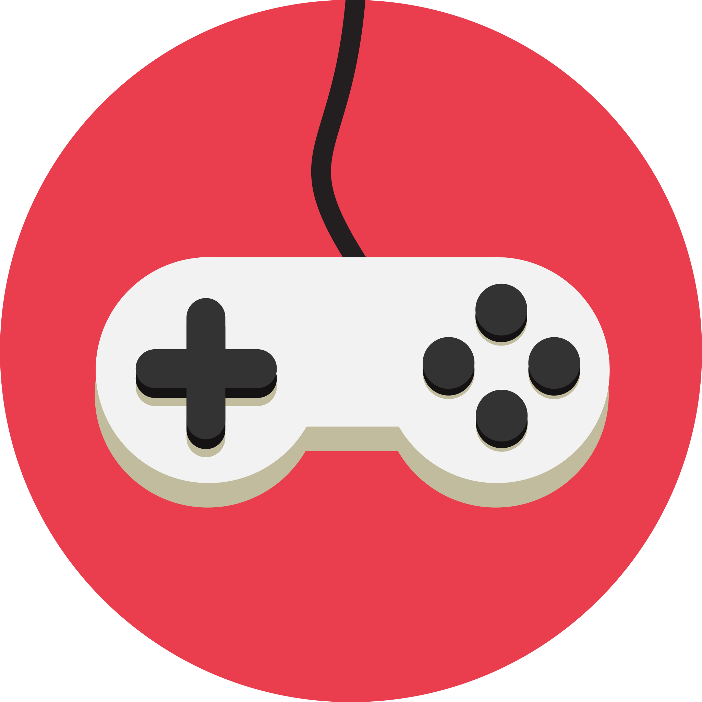

<!-- Slide d'obertura. Presenteu-vos i doneu la benvinguda. -->

---

# Jugueu a videojocs?

- A quins?
- Per què?

> Jugar a videojocs pot ser **diferent** a crear-los.

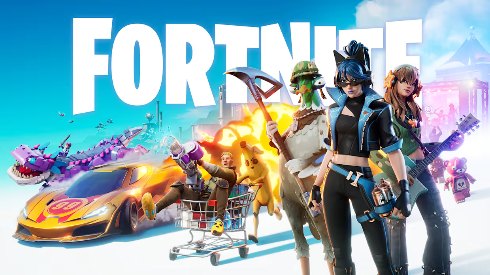 
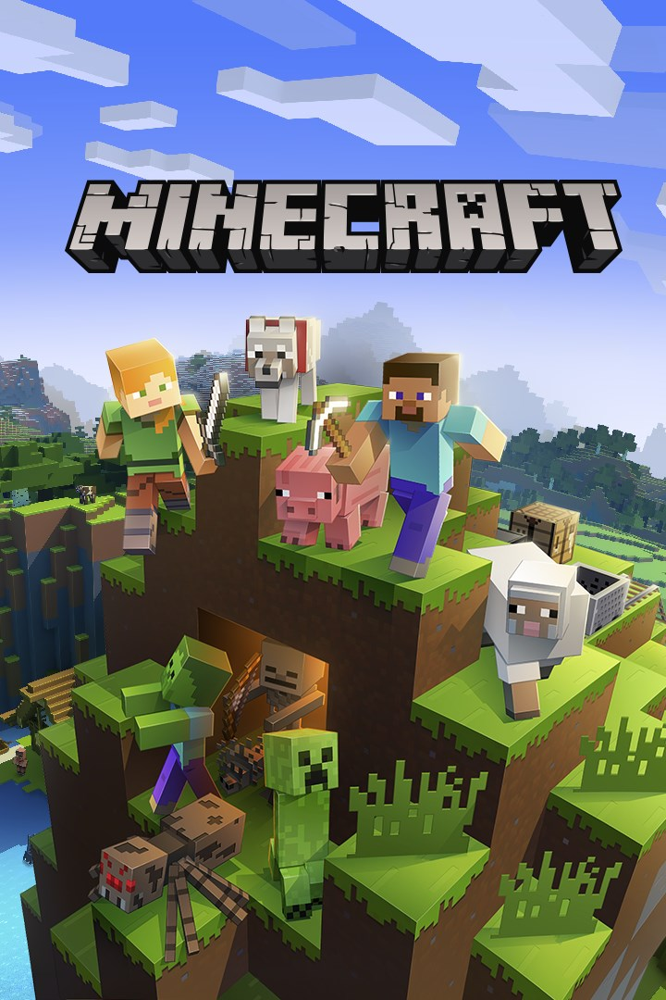

<!-- Trenca-gel. Deixeu que responguin en veu alta, creeu ambient. -->

---

# Els meus jocs favorits

Coneixeu algun d'aquests?

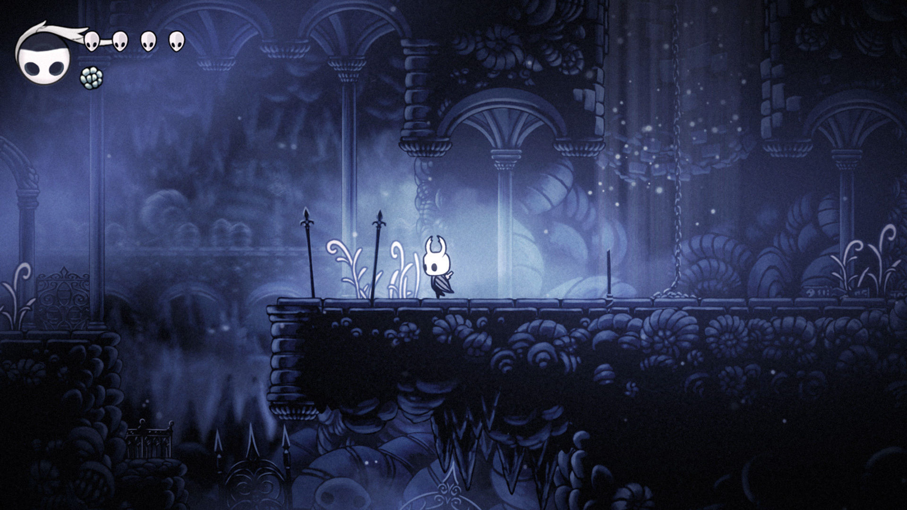 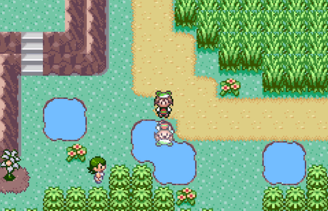 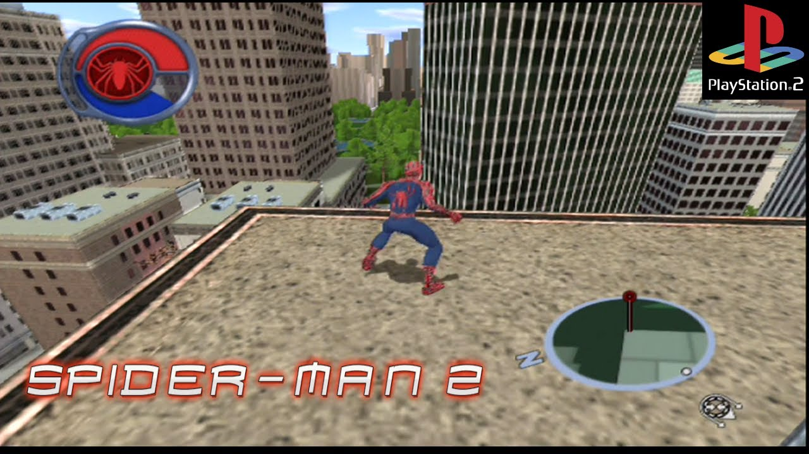

<!-- Ensenyeu els vostres jocs preferits. Connecteu amb els seus. -->

---

# Com es fa un videojoc?

- Què és un videojoc?
- Quin és el seu **objectiu**?
- Quines **parts** té?
- Qui hi **participa**?

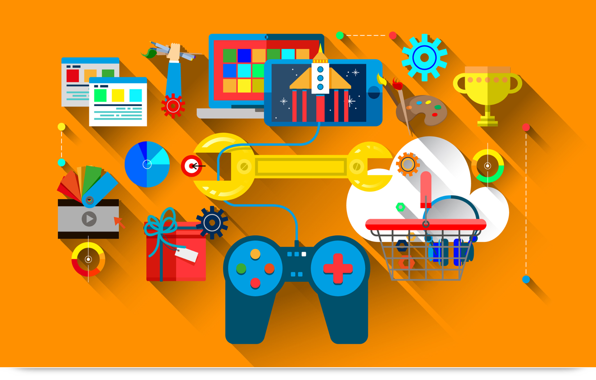

<!-- Llanceu les 4 preguntes i que provin de respondre abans de passar a les respostes. -->

---

# Com es fa un videojoc?

- **Què és?** Una aplicació interactiva.
- **Objectiu?** Principalment entretenir, però també educar, comunicar o experimentar.
- **Parts?** Gràfics, àudio, codi, interfícies, nivells, narrativa, física...
- **Qui hi participa?** Programadors, artistes, dissenyadors, compositors, testers i més!

<!-- Repàs de les respostes. Remarqueu que un joc és molta gent i moltes parts. -->

---

# Experiències prèvies

- Heu intentat fer algun joc abans?
- Coneixeu algun llenguatge de programació?

> Avui **partirem de zero**. 🙂

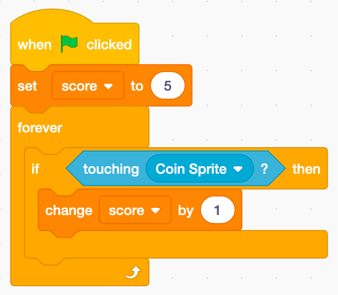 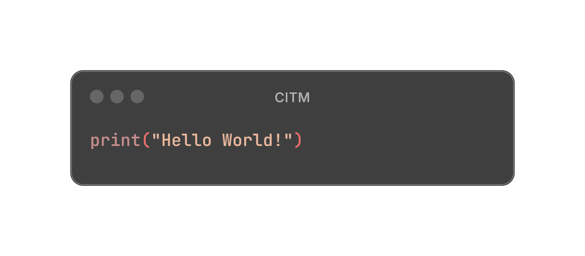

<!-- Mesureu el nivell de la sala. Tranquil·litzeu els qui no han programat mai. -->

---

# Motors de videojocs

Què són? Programes que ens donen fet allò difícil (física, gràfics, sons...) perquè ens centrem a **crear el joc**.

  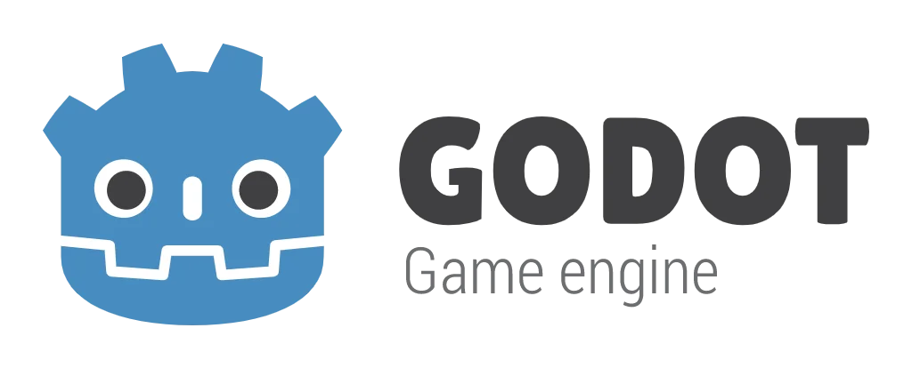

<!-- Definiu "motor" amb una analogia senzilla (com una cuina ja muntada). Avui: Unity i Godot. -->

---

# Què farem?

- **Flappy Bird**  - 2 dies
- **Plataformes 3D**  - 2 dies

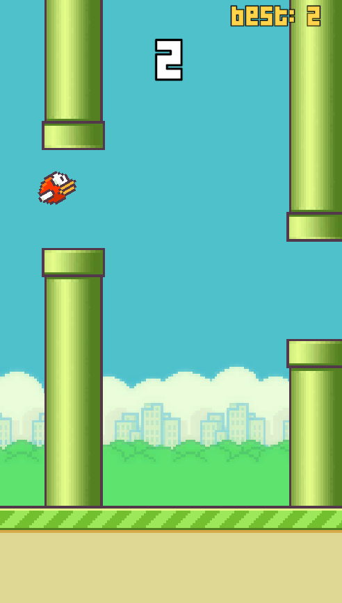 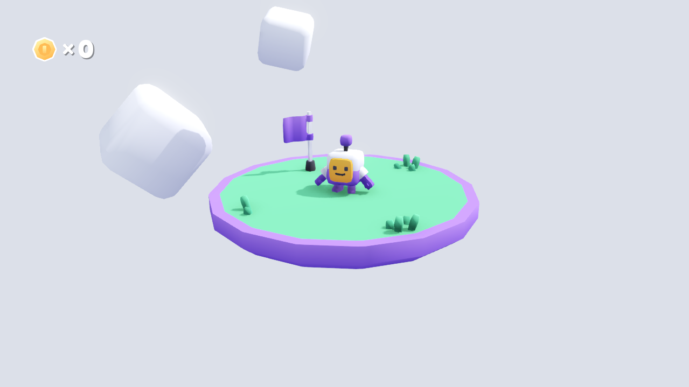

<!--   -->

---

# No hi ha cap pregunta estúpida

Esteu aquí per **aprendre** i **divertir-nos**.
Cap dubte és dolent. Fer jocs és **difícil**.

<!-- Missatge clau abans de començar: seguretat psicològica. -->

---

<!-- _paginate: false -->

# Comencem? 🚀
